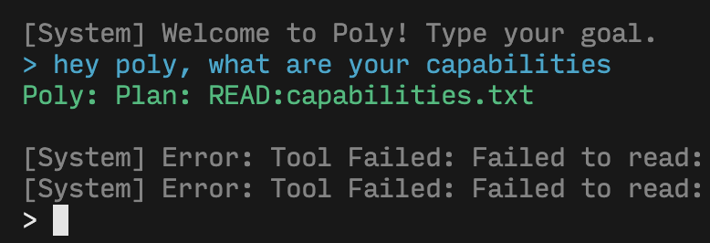

# Poly: Structure-aware CLI Coding Agent



Poly is a high-performance, structure-aware CLI coding agent built in OCaml. Unlike traditional agents that treat code as text strings, Poly treats code as data (ASTs), allowing for more accurate analysis, safer edits, and "predictive coding" capabilities.

## Core Architecture

Poly is built on four decoupled layers:

1.  **The Brain (Reasoning Layer)**:
    - Implements the Agentic Loop (Thinking -> Acting -> Verifying).
    - Uses an LLM (Gemini) to plan and execute tasks.
    - Supports tool use (`WRITE`, `READ`, `INDEX`).

2.  **The Perception Engine (The Eyes)**:
    - **PolyParser**: Converts OCaml code into a Universal AST (`Poly_ast`).
    - **PolyIndex**: Builds a Symbol Table to understand code structure (functions, variables).

3.  **The Execution Layer (The Hands)**:
    - **PolyVFS**: A sandboxed Virtual File System.
    - **Sandboxing**: Prevents the agent from accessing files outside the workspace (e.g., `../sensitive_file`).
    - Supports `list_dir`, `delete`, `mkdir`, and atomic commits.

4.  **The Interface Layer (The Shell)**:
    - **CLI**: Robust command-line interface using `Cmdliner`.
    - **TUI**: Interactive terminal output using `Notty` for visualizing symbol tables.

## Usage

### Start the Agent
Give the agent a goal, and it will plan and execute it.
```bash
dune exec poly -- start "Create a hello world file in OCaml"
```

### Index a File
View the symbols (functions, variables) in a file.
```bash
dune exec poly -- index lib/poly_brain.ml
```

### Parse a File
View the Abstract Syntax Tree (AST) of a file.
```bash
dune exec poly -- parse lib/poly_brain.ml
```

### Test AI Connection
Verify your API key and connection to the LLM.
```bash
dune exec poly -- ai-test
```

## 🛠️ Installation

1.  **Prerequisites**: OCaml 5.0+, Dune, Opam.
2.  **Install Dependencies**:
    ```bash
    opam install . --deps-only
    ```
3.  **Build**:
    ```bash
    dune build
    ```
4.  **Set API Key**:
    ```bash
    export GEMINI_API_KEY="your_api_key"
    ```

## Project Structure

- `bin/`: Entry point (`main.ml`).
- `lib/`: Core logic.
    - `perception/`: Parser and Indexer.
    - `reasoning/`: Brain and Tools.
    - `execution/`: VFS and Sandboxing.
    - `interface/`: CLI and TUI.
- `test/`: Unit and integration tests.
